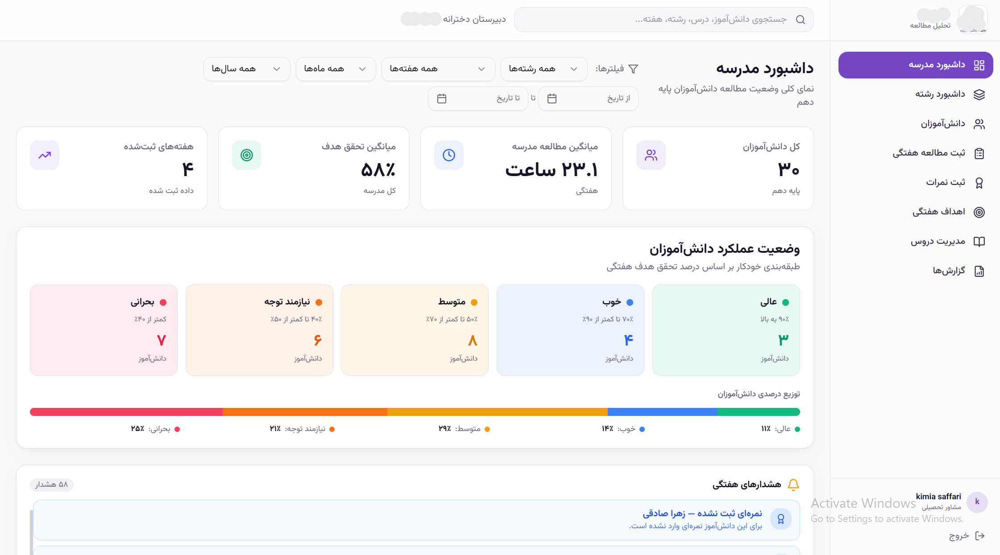
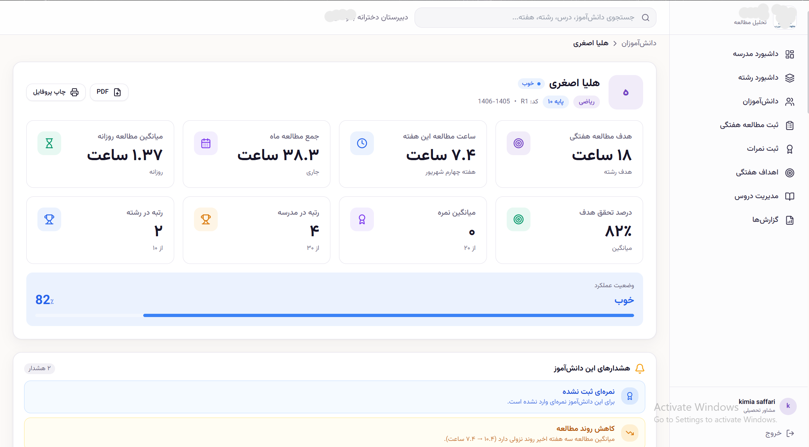
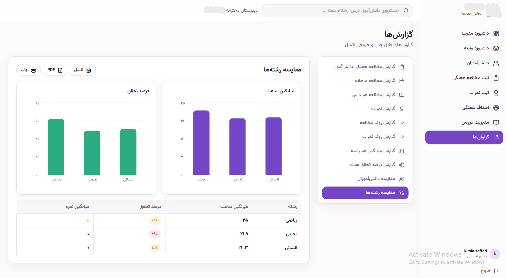

# Student Study Analytics Dashboard

A web-based dashboard for tracking student study habits and academic performance in a high school. I designed and built it as a client project for a girls' high school, where it was used to monitor 10th-grade students across the math, science, and humanities tracks.

> **Note:** This was delivered as private client work, so the source code is not public. This repository is an overview of the project with screenshots. All data shown is fictional demo data.

## The Problem

School counselors had no simple way to see how much students were actually studying each week, whether they were meeting their goals, or which students needed attention early. This system brings that information into one place.

## Key Features

- **School dashboard:** overall view of the whole grade, including total students, average weekly study hours, and average goal achievement
- **Automatic performance classification:** students are grouped by weekly goal achievement into five levels: Excellent (90%+), Good (70-90%), Average (50-70%), Needs Attention (40-50%), and Critical (below 40%)
- **Field dashboard:** study statistics broken down by track (math, science, humanities)
- **Student management:** a searchable list of students
- **Weekly study logging:** record study hours for each student every week
- **Grade entry:** record and track exam scores
- **Weekly goals:** set targets and measure how well each student meets them
- **Course management:** manage the subjects taught
- **Reports:** summaries for counselors
- **Filters:** filter data by track and date range
- **Persian interface** with full right-to-left (RTL) layout

## Screenshots

### School Dashboard

### Students

### Reports

## Tech Stack

- Built with Base44
- Persian (RTL) user interface

## What I Learned

- Turning a real client's needs into a working product
- Designing dashboards that make data easy to read at a glance
- Building a fully right-to-left interface for Persian users

## Author

**Kimia Saffari**
Computer Engineering student, Sharif University of Technology
GitHub: [@Kim1284](https://github.com/Kim1284)
